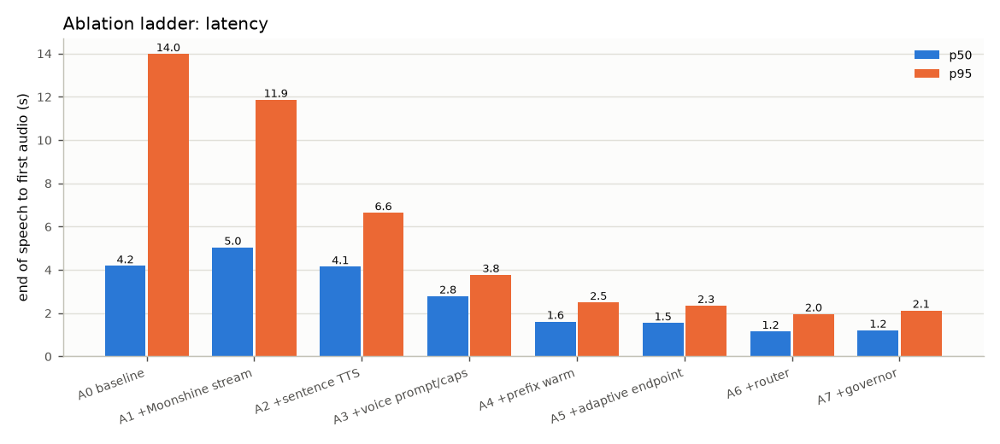
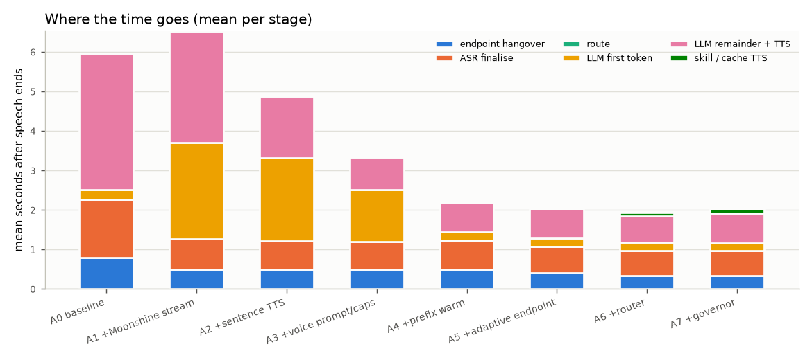
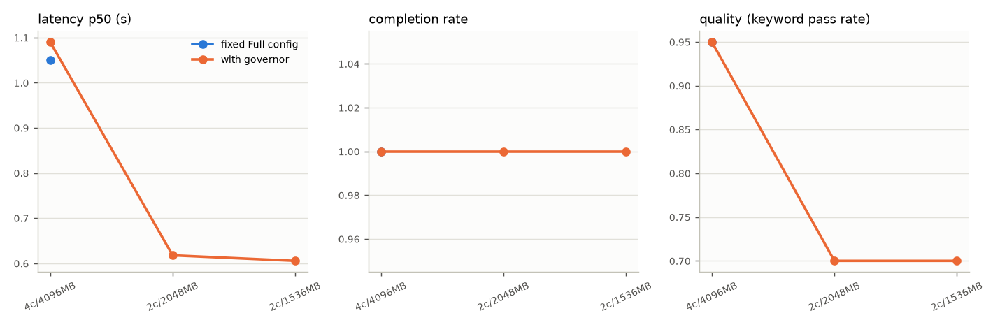
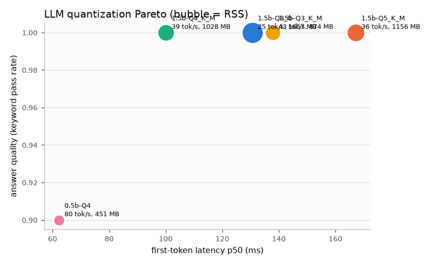
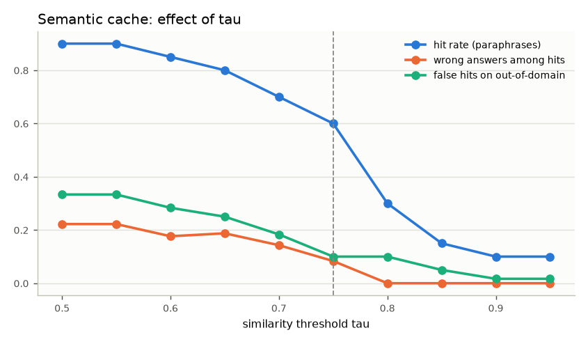

# PocketVoice benchmark report

Generated by `bench/make_report.py` from `bench/out/*.json`. Every number below is read from those files.

## 1. Baseline vs ladder (4 cores / 4096 MB, 60 spoken requests x 3 repeats, warm-up discarded)

| Step | p50 ms | p95 ms | mean ms | worst ms | peak RSS MB | CPU-s/turn | J/turn (RAPL, net of idle) | J/turn (proxy) | WER | quality | LLM avoided |
|---|---|---|---|---|---|---|---|---|---|---|---|
| A0 baseline | 4,180 | 13,976 | 5,158 | 21,549 | 1,958 | 17.1 | 32.2 | 102.6 | 0.061 | 0.75 | 0% |
| A1 +Moonshine stream | 5,033 | 11,859 | 6,017 | 25,014 | 2,759 | 11.0 | 116.4 | 66.3 | 0.057 | 0.64 | 0% |
| A2 +sentence TTS | 4,144 | 6,634 | 4,375 | 7,286 | 2,295 | 11.3 | 87.8 | 67.7 | 0.060 | 0.70 | 0% |
| A3 +voice prompt/caps | 2,784 | 3,765 | 2,841 | 4,417 | 1,978 | 6.6 | 52.8 | 39.9 | 0.060 | 0.64 | 0% |
| A4 +prefix warm | 1,608 | 2,492 | 1,676 | 3,097 | 1,937 | 6.8 | 26.4 | 40.6 | 0.058 | 0.66 | 0% |
| A5 +adaptive endpoint | 1,538 | 2,341 | 1,617 | 3,092 | 1,954 | 6.7 | 52.0 | 40.5 | 0.059 | 0.68 | 0% |
| A6 +router | 1,154 | 1,956 | 1,148 | 2,569 | 2,028 | 4.9 | 39.3 | 29.6 | 0.056 | 0.93 | 45% |
| A7 +governor | 1,205 | 2,121 | 1,200 | 3,133 | 1,733 | 5.0 | 35.1 | 29.9 | 0.059 | 0.93 | 45% |

Energy source: Windows Energy Meter RAPL package power (whole machine), measured. The proxy column is cpu-seconds x 6.0 W/core (an assumption, not a measurement). RAPL is whole-package power and includes background load, so it is reported net of the idle draw measured immediately before each run.

Idle (always-on front end only): A0 baseline: 2.0% CPU, 1,502 MB RSS; A7 +governor: 2.7% CPU, 1,589 MB RSS

## 2. Degradation: fixed Full config vs governor

| Limit | config | completion | p50 ms | quality |
|---|---|---|---|---|
| 4c/4096MB | fixed | 100% | 1,049 | 0.95  |
| 2c/2048MB | fixed | 0% | n/a | n/a (startup failed) |
| 2c/1536MB | fixed | 0% | n/a | n/a (startup failed) |
| 4c/4096MB | governor | 100% | 1,090 | 0.95  |
| 2c/2048MB | governor | 100% | 618 | 0.70  |
| 2c/1536MB | governor | 100% | 605 | 0.70  |

## 3. Quantization and offload

| LLM | tok/s | first token ms (p50) | RSS MB | USS MB | quality (20 open prompts) |
|---|---|---|---|---|---|
| 1.5b-Q8_0 | 24.7 | 131 | 1,657 | 1,645 | 1.00 |
| 1.5b-Q5_K_M | 35.6 | 167 | 1,156 | 1,144 | 1.00 |
| 1.5b-Q4_K_M | 39.0 | 100 | 1,028 | 1,016 | 1.00 |
| 1.5b-Q3_K_M | 42.6 | 138 | 874 | 862 | 1.00 |
| 0.5b-Q4 | 80.1 | 62 | 451 | 440 | 0.90 |

| KV cache / flash attention | tok/s | first token ms | RSS MB |
|---|---|---|---|
| kv=q8_0,flash_attn=1 | 38.9 | 102 | 1,023 |
| kv=f16,flash_attn=1 | 39.5 | 98 | 1,039 |
| kv=f16,flash_attn=0 | 38.6 | 106 | 1,041 |

| ASR | WER | RTF | process RSS MB |
|---|---|---|---|
| whisper-base.en-int8 | 0.081 | 0.42 | 179 |
| whisper-base.en-fp32 | 0.076 | 0.54 | 379 |
| moonshine-tiny | 0.101 | 0.18 | 187 |
| moonshine-small | 0.058 | 0.42 | 367 |

| TTS | RTF | Whisper-WER of output |
|---|---|---|
| en_US-lessac-medium | 0.070 | 0.053 |
| en_US-lessac-low | 0.054 | 0.000 |

Offload evidence: cold load 1.67 s, unload 0.01 s (models resident afterwards: 0); resident runner RSS 1,017 MB vs private (USS) 1,005 MB (weights are loaded into private memory, not left memory-mapped); pinned 39.7 tok/s vs unpinned 39.0 tok/s.

## 5. Cache honesty

Dev set (tau and margin are chosen here only):

| margin | tau | hit rate | wrong answers among hits | false hits on out-of-domain |
|---|---|---|---|---|
| 0.03 | 0.50 | 0.90 | 0.22 | 0.33 |
| 0.03 | 0.55 | 0.90 | 0.22 | 0.33 |
| 0.03 | 0.60 | 0.85 | 0.18 | 0.28 |
| 0.03 | 0.65 | 0.80 | 0.19 | 0.25 |
| 0.03 | 0.70 | 0.70 | 0.14 | 0.18 |
| 0.03 | 0.75 | 0.60 | 0.08 | 0.10 |
| 0.03 | 0.80 | 0.30 | 0.00 | 0.10 |
| 0.03 | 0.85 | 0.15 | 0.00 | 0.05 |
| 0.03 | 0.90 | 0.10 | 0.00 | 0.02 |
| 0.03 | 0.95 | 0.10 | 0.00 | 0.02 |
| 0.05 | 0.50 | 0.70 | 0.14 | 0.27 |
| 0.05 | 0.55 | 0.70 | 0.14 | 0.27 |
| 0.05 | 0.60 | 0.65 | 0.08 | 0.23 |
| 0.05 | 0.65 | 0.60 | 0.08 | 0.23 |
| 0.05 | 0.70 | 0.55 | 0.09 | 0.17 |
| 0.05 | 0.75 | 0.55 | 0.09 | 0.08 |
| 0.05 | 0.80 | 0.30 | 0.00 | 0.08 |
| 0.05 | 0.85 | 0.15 | 0.00 | 0.05 |
| 0.05 | 0.90 | 0.10 | 0.00 | 0.02 |
| 0.05 | 0.95 | 0.10 | 0.00 | 0.02 |

Chosen on dev: tau=0.75, margin=0.03 (max dev hit rate s.t. wrong-answer rate <= 10% and false hits on negatives <= 10%).
Held-out (n=10 positives, 10 negatives) at the chosen setting: hit 0.50, wrong 0.20, false hits 0.00; at the spec default 0.80/0.05: hit 0.20, wrong 0.00.

Failure cases at the chosen setting (held-out first):

- `hello hello anybody home` expected `can_you_hear`, got `None` (sim 0.9, margin 0.02)
- `you are really good at this` expected `compliment`, got `None` (sim 0.77, margin 0.02)
- `what's your favourite thing to eat` expected `favorite_food`, got `None` (sim 0.71, margin 0.03)
- `tell me about yourself` expected `whats_your_name`, got `capabilities` (sim 0.8, margin 0.12)
- `I have a stressful exam tomorrow` expected `stress`, got `None` (sim 0.61, margin 0.07)
- `what is the weather going to be tomorrow` expected `weather`, got `None` (sim 0.74, margin 0.21)
- `hi friend how is your day going` expected `how_are_you`, got `None` (sim 0.61, margin 0.0)
- `could you tell me who you are` expected `whats_your_name`, got `capabilities` (sim 0.79, margin 0.08)
- `thanks a ton for that` expected `thanks`, got `None` (sim 0.6, margin 0.06)
- `see you tomorrow then` expected `goodbye`, got `None` (sim 0.57, margin 0.1)
- `is anything I say uploaded somewhere` expected `privacy`, got `None` (sim 0.45, margin 0.03)
- `you did a great job` expected `compliment`, got `None` (sim 0.74, margin 0.04)
- `I could use some cheering up` expected `motivation`, got `None` (sim 0.68, margin 0.23)
- `good night and sleep tight` expected `good_night`, got `None` (sim 0.73, margin 0.05)

